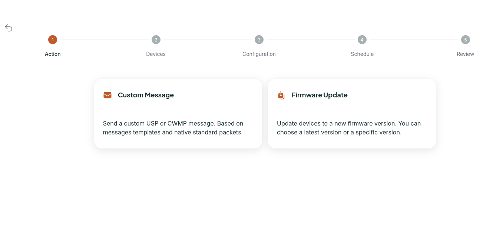

---
layout:
  title:
    visible: true
  description:
    visible: false
  tableOfContents:
    visible: true
  outline:
    visible: true
  pagination:
    visible: true
---

# Architecture

The CPE communicates to a HTTP server, also called Auto Configuration Server (ACS), because instead of a normal client-server relationship between the device and the HTTP server, what happens is that the  connection can be initiated from the server to the device.

<figure><figcaption>
TR-069 Issue Amendment 6 Corrigendum 1 - Section 3.7.3 - FIgure 3
</figcaption></figure>

As you can see above, the ACS and the CPE are at the same time a HTTP client and server, it's needed to exchange messages according to the CWMP protocol and because they're both a client and a server, must not exist [NAT](https://en.wikipedia.org/wiki/Network\_address\_translation) between the CPE and the ACS, they need to be directly accessible to each other.

Although there are some workarounds for the NAT problem as to use [XMPP](https://app.gitbook.com/s/ys3ycSw4qx1SjsJeAo2N/) or [STUN](https://en.wikipedia.org/wiki/STUN), the best option is still to install the ACS with direct connection to the CPE, this simplifies your deployment and ensures a smooth solution.

## Messages

Here are the main messages you can send to a CPE and to interact with it. All of them are available in the [Oktopus REST API ](https://documenter.getpostman.com/view/18932104/2s93eR3vQY#96986790-3e2c-44fd-bc8c-9a6208f01516)> Device > CWMP Native Messages.

* GetParameterNames
* GetParameterValues
* GetParameterAttributes
* SetParameterValues
* AddObject
* DeleteObject

## Data Model

The first Data Model created to be used with CWMP was the [TR-098](https://cwmp-data-models.broadband-forum.org/tr-098-1-8-0.html), after that came that the [TR-181](https://usp-data-models.broadband-forum.org/tr-181-2-16-0-usp.html) which has more capabilities and possibilities than it's predecessor.

## Encoding

The messages between the CPE and the ACS are exchanged using [SOAP](https://www.geeksforgeeks.org/basics-of-soap-simple-object-access-protocol/), that transfer messages in the format of [XML](https://en.wikipedia.org/wiki/XML), and contains structured data with [RPC](https://en.wikipedia.org/wiki/Remote\_procedure\_call) information.

