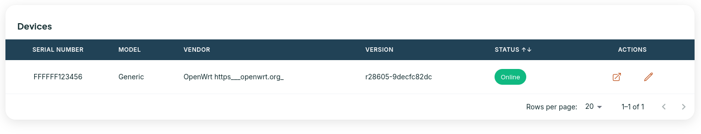

# OpenWRT
The OpenWrt Project is a Linux operating system targeting embedded devices. Instead of trying to create a single, static firmware, OpenWrt provides a fully writable filesystem with package management. This frees you from the application selection and configuration provided by the vendor and allows you to customize the device through the use of packages to suit any application. For developers, OpenWrt is the framework to build an application without having to build a complete firmware around it; for users this means the ability for full customization, to use the device in ways never envisioned.

For more details go to the OpenWRT oficial Website at: https://openwrt.org/

## Installation
TR069 client is not available by default in OpenWRT images. Most users use EasyCwmp (https://easycwmp.org/) to have CWMP management capabilities. It's possible to build easycwmp package and install in your OpenWRT system or compile the entire system with EasyCwmp enabled.

### Build Package
Download the OpenWRT SDK. It's available in the same page as OpenWRT images. After that download MicroXML and EasyCwmp and put them under the packages folder from the SDK:

**EasyCwmp download:** https://easycwmp.org/get/

**MicroXML download:** https://easycwmp.org/download/libmicroxml.tar.gz

```shell
cd openwrt-sdk-23.05.5-x86-64_gcc-12.3.0_musl.Linux-x86_64
┌[user@linux] [/dev/pts/2]
└[~/Documents/GitHub/openwrt-sdk-23.05.5-x86-64_gcc-12.3.0_musl.Linux-x86_64]> cd package
┌[user@linux] [/dev/pts/2]
└[~/Documents/GitHub/openwrt-sdk-23.05.5-x86-64_gcc-12.3.0_musl.Linux-x86_64/package]> ls
easycwmp  kernel  libmicroxml  Makefile  toolchain
┌[user@linux] [/dev/pts/2]
└[~/Documents/GitHub/openwrt-sdk-23.05.5-x86-64_gcc-12.3.0_musl.Linux-x86_64/package]>
```
Build both packages:

```shell
make menuconfig
```
Navigate to libmicroxml and easycwmp and check both of them.

```shell
make package/easycwmp/compile
```

After compilation is finished both packages will be available at the folder **bin/packages/x86_64/base/**

Copy both files to inside the OpenWRT system and install them using the apk utility:

```shell
root@OpenWrt:~# apk add libmicroxml-1.0.0-r1.apk
fetch https://downloads.openwrt.org/snapshots/targets/x86/64/packages/packages.adb
fetch https://downloads.openwrt.org/snapshots/packages/x86_64/base/packages.adb
fetch https://downloads.openwrt.org/snapshots/packages/x86_64/luci/packages.adb
fetch https://downloads.openwrt.org/snapshots/packages/x86_64/packages/packages.adb
fetch https://downloads.openwrt.org/snapshots/packages/x86_64/routing/packages.adb
fetch https://downloads.openwrt.org/snapshots/packages/x86_64/telephony/packages.adb
fetch https://downloads.openwrt.org/snapshots/packages/x86_64/video/packages.adb
OK: 16 MiB in 131 packages
```

```shell
root@OpenWrt:~# apk add easycwmp-1.8.6.apk
OK: 16 MiB in 131 packages
```

Check if EasyCwmp is working:

```shell
root@OpenWrt:~# /etc/init.d/easycwmpd start
root@OpenWrt:~# /etc/init.d/easycwmpd status
running
root@OpenWrt:~# easycwmp get Device.DeviceInfo.Manufacturer
{ "parameter": "Device.DeviceInfo.Manufacturer", "value": "OpenWrt\nhttps___openwrt.org_" }
```

## Configuration

To configure EasyCwmp parameter edit the file **/etc/config/easycwmp**

You can set the bellow settings:

```
config local
	option enable '1'
	option interface 'eth0'
	option port '7547'
	option ubus_socket '/var/run/ubus.sock'
	option date_format '%FT%T%z'
	option username 'easycwmp'
	option password 'easycwmp'
	option authentication 'Digest'
	option logging_level '3'

config acs
	option url 'http://192.168.10.53:9292/acs'
	option username 'easycwmp'
	option password 'easycwmp'
	option periodic_enable '1'
	option periodic_interval '100'
	option periodic_time '0001-01-01T00:00:00Z'

config device
	option manufacturer 'OpenWrt
https___openwrt.org_'
	option oui 'FFFFFF'
	option product_class 'Generic'
	option serial_number 'FFFFFF123456'
	option hardware_version 'v0'
	option software_version 'r28605-9decfc82dc'
```

Change the option **url** and point it to the Oktopus controller. Restart the EasyCwmp daemon and check if the device appears at the Oktopus Controller Devices tab:

```shell
vi /etc/config/easycwmp
/etc/init.d/easycwmpd restart
```

Controller View:

<figure><figcaption><p>OpenWRT Device Online</p></figcaption></figure>