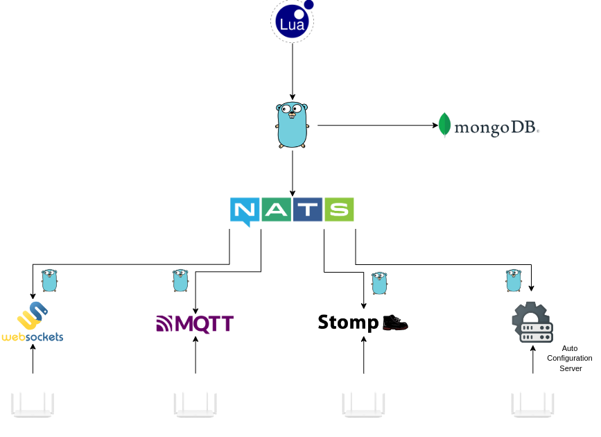

# Device Profile Script

## Introduction

Code is wrritten in **Lua**, which is a lightweight, high-level programming language designed for embedded use, known for its simplicity and efficiency. Created in Brazil in 1993, it features dynamic typing, first-class functions, and a powerful table data structure, making it versatile for various applications. Lua is widely used in game development for scripting game logic, as well as in embedded systems and applications due to its **extensibility and small footprint**, allowing developers to easily integrate it with other languages and platforms.

[LUA 5.1 Manual](https://www.lua.org/manual/5.1/)&#x20;

### How It Works

To extend Oktopus capabilities and adress the most diverse possible use cases we opted to use a scripting language on top of the actual code, so the [gopher-lua](https://github.com/yuin/gopher-lua) library provides Go APIs that allows to easily embed LUA scripts to Go programs.

The Go software can interact to the LUA script and vice-versa. That way, it's possible to pass functions, parameters and events through both USP Controller/ACS and the user created automations.

### Core Concepts

A "custom function", is as a function called from LUA which translates to a Go function that can interact with NATS, MongoDB, USP Controller, TR-069 ACS and all the other components of the software stack.

<figure><figcaption><p>Diagram of Lua Scripts</p></figcaption></figure>

The "custom functions" will be detailed above in the next topics as just "functions" and separated into domain areas. We hope to provide usefull examples, and the limitation is on each person creativity.&#x20;

## Function Contract

All Lua hooks should return two values:

```lua
-- success
return value, nil

-- failure
return nil, "error message"
```

Notes:

- For `get_*` payload builders, return CWMP XML as `string`.
- For `parse_*`, return a Lua table compatible with expected Go resource structs.
- For metadata/capabilities, return string/boolean/table depending on function.

## Shared Helper (optional)

```lua
local function response_to_map(response)
  local out = {}
  for _, param in ipairs(response.list or {}) do
    out[param.name] = param.value
  end
  return out
end
```

## Functions

### get_vendor()

Returns the vendor label used by the API.

#### Protocol:

CWMP and USP

#### Params:

None.

Return:

- `value`: `string`
- `err`: `nil` or `string`

Example:

```lua
function get_vendor()
  return "Huawei", nil
end
```

### get_data_model()

Returns the data model handled by the script.

#### Protocol:

CWMP

#### Params:

None.

Return:

- `value`: `string` (for example: `TR-098`, `TR-181`)
- `err`: `nil` or `string`

Example:

```lua
function get_data_model()
  return "TR-098", nil
end
```

### get_device_capabilities()

Defines which resources/features are enabled for this model.

#### Protocol:

CWMP and USP

#### Params:

None.

Return:

- `value`: `table` with capability keys
- `err`: `nil` or `string`

Example:

```lua
function get_device_capabilities()
  return {
    Radio = true,
    Ssid = true,
    ConnectedDevices = true,
    Ping = true,
    Traceroute = true,
    Interfaces = true,
    Ports = true,
    Stats = true,
    Hwinfo = true,
    Pon = true,
    Voice = false,
    Cellular = false,
    XDSL = false,
  }, nil
end
```

### get_device_specs()

Defines device behavior details (for example traceroute wait time).

#### Protocol:

CWMP and USP

#### Params:

None.

Return:

- `value`: `table`
- `err`: `nil` or `string`

Example:

```lua
function get_device_specs()
  return {
    TimeTraceRoute = 3,
    DirectResult = false,
  }, nil
end
```

### is_real_time()

Indicates whether this model should be treated as real-time for operations.

#### Protocol:

CWMP

#### Params:

None.

Return:

- `value`: `boolean`
- `err`: `nil` or `string`

Example:

```lua
function is_real_time()
  return false, nil
end
```

### get_radio()

Builds CWMP payload to fetch radio data.

#### Protocol:

CWMP and USP

#### Params:

None.

Return:

- `value`: `string` (CWMP XML)
- `err`: `nil` or `string`

Example:

```lua
function get_radio()
  return cwmp_get_params({
    "InternetGatewayDevice.LANDevice.1.WLANConfiguration.",
  }), nil
end
```

### parse_radio(response)

Parses CWMP response into radio resource list.

#### Protocol:

CWMP and USP

#### Params:

1. `response` `[table]` CWMP response (`response.list`)

Return:

- `value`: `table` (`[]Radio`)
- `err`: `nil` or `string`

Example:

```lua
function parse_radio(response)
  local m = response_to_map(response)
  local radios = {
    {
      path = "InternetGatewayDevice.LANDevice.1.WLANConfiguration.1.",
      enable = { writable = true, value = m["InternetGatewayDevice.LANDevice.1.WLANConfiguration.1.RadioEnabled"] == "1" },
      channel = { writable = true, value = tonumber(m["InternetGatewayDevice.LANDevice.1.WLANConfiguration.1.Channel"]) or 0 },
    }
  }
  return radios, nil
end
```

### set_radio(radios)

Builds CWMP payload to update radio configuration.

#### Protocol:

CWMP and USP

#### Params:

1. `radios` `[table]` radio list

Return:

- `value`: `string` (CWMP XML)
- `err`: `nil` or `string`

Example:

```lua
function set_radio(radios)
  -- Return nil to use Go fallback while you implement custom payload.
  return nil, nil
end
```

### get_ssid()

Builds CWMP payload to fetch SSID data.

#### Protocol:

CWMP and USP

#### Params:

None.

Return:

- `value`: `string` (CWMP XML)
- `err`: `nil` or `string`

Example:

```lua
function get_ssid()
  return cwmp_get_params({
    "InternetGatewayDevice.LANDevice.1.WLANConfiguration.",
  }), nil
end
```

### parse_ssid(response)

Parses CWMP response into SSID resource list.

#### Protocol:

CWMP and USP

#### Params:

1. `response` `[table]`

Return:

- `value`: `table` (`[]Ssid`)
- `err`: `nil` or `string`

Example:

```lua
function parse_ssid(response)
  local ssids = {
    {
      path = "InternetGatewayDevice.LANDevice.1.WLANConfiguration.1.",
      ssid = { writable = true, value = "MyWiFi" },
      enable = { writable = true, value = true },
    }
  }
  return ssids, nil
end
```

### set_ssid(ssids)

Builds CWMP payload to update SSID configuration.

#### Protocol:

CWMP and USP

#### Params:

1. `ssids` `[table]`

Return:

- `value`: `string` (CWMP XML)
- `err`: `nil` or `string`

Example:

```lua
function set_ssid(ssids)
  return nil, nil
end
```

### get_site_survey_diagnostic_state()

Returns site survey diagnostic state.

#### Protocol:

CWMP and USP

#### Params:

None.

Return:

- `value`: `string`
- `err`: `nil` or `string`

Example:

```lua
function get_site_survey_diagnostic_state()
  return "None", nil
end
```

### set_site_survey_diagnostic_state()

Sets site survey diagnostic state to Requested.

#### Protocol:

USP

#### Params:

None.

Return:

- `value`: `string`
- `err`: `nil` or `string`

Example:

```lua
function set_site_survey_diagnostic_state()
  return {
    update_objs = {
      {
        obj_path = "Device.WiFi.NeighboringWiFiDiagnostic.",
        param_settings = {
          { param = "DiagnosticsState", value = "Requested", required = true }
        }
      }
    }
  }, nil
end
```

### get_site_survey_results()

Builds payload to fetch site survey results.

#### Protocol:

CWMP and USP

#### Params:

None.

Return:

- `value`: `string` (XML)
- `err`: `nil` or `string`

Example:

```lua
function get_site_survey_results()
  return cwmp_get_params({
    "InternetGatewayDevice.LANDevice.1.WiFi.NeighboringWiFiDiagnostic.",
  }), nil
end
```

### parse_get_site_survey(response)

Parses site survey result set.

#### Protocol:

CWMP e USP

#### Params:

1. `response` `[table]`

Return:

- `value`: `table` (`map[string][]NeighborSites`)
- `err`: `nil` or `string`

Example:

```lua
function parse_get_site_survey(response)
  return {
    ["2.4GHz"] = {
      { ssid = "AP-1", channel = 1, signal_strength = -45 },
    }
  }, nil
end
```

### get_connected_devices()

Builds payload to fetch connected devices.

#### Protocol:

CWMP and USP

#### Params:

None.

Return:

- `value`: `string` (XML)
- `err`: `nil` or `string`

Example:

```lua
function get_connected_devices()
  return cwmp_get_params({
    "InternetGatewayDevice.LANDevice.1.Hosts.Host.",
  }), nil
end
```

### parse_get_connected_devices(response)

Parses connected devices response.

#### Protocol:

CWMP and USP

#### Params:

1. `response` `[table]`

Return:

- `value`: `table` (`ConnectedDevices`)
- `err`: `nil` or `string`

Example:

```lua
function parse_get_connected_devices(response)
  return {
    ethernet = {
      { host_name = "desktop", ip = "192.168.1.10", mac = "AA:BB:CC:DD:EE:FF" }
    },
    wifi = {}
  }, nil
end
```

### set_speed_test(test)

Builds payload to configure speed test.

#### Protocol:

CWMP and USP

#### Params:

1. `test` `[table]`

Return:

- `value`: `string` (XML)
- `err`: `nil` or `string`

Example:

```lua
function set_speed_test(test)
  return nil, nil
end
```

### get_speed_test_result(speed_test_type)

Builds payload to fetch speed test result.

#### Protocol:

CWMP and USP

#### Params:

1. `speed_test_type` `[string]` (`download` or `upload`)

Return:

- `value`: `string` (XML)
- `err`: `nil` or `string`

Example:

```lua
function get_speed_test_result(speed_test_type)
  if speed_test_type == "download" then
    return cwmp_get_params({"InternetGatewayDevice.DownloadDiagnostics."}), nil
  end
  return cwmp_get_params({"InternetGatewayDevice.UploadDiagnostics."}), nil
end
```

### parse_get_speed_test_result(speed_test_type, response)

Parses speed test result.

#### Protocol:

CWMP and USP

#### Params:

1. `speed_test_type` `[string]`
2. `response` `[table]`

Return:

- `value`: `table` (`Speedtest`)
- `err`: `nil` or `string`

Example:

```lua
function parse_get_speed_test_result(speed_test_type, response)
  return {
    diagnostic_state = "Completed",
    type = speed_test_type,
    download_speed = "900 Mbps",
    upload_speed = "450 Mbps",
  }, nil
end
```

### get_download_diagnostic_state()

Returns download diagnostic state path or state marker for the model.

#### Protocol:

CWMP

#### Params:

None.

Return:

- `value`: `string`
- `err`: `nil` or `string`

Example:

```lua
function get_download_diagnostic_state()
  return "InternetGatewayDevice.DownloadDiagnostics.DiagnosticsState", nil
end
```

### get_upload_diagnostic_state()

Returns upload diagnostic state path or state marker for the model.

#### Protocol:

CWMP

#### Params:

None.

Return:

- `value`: `string`
- `err`: `nil` or `string`

Example:

```lua
function get_upload_diagnostic_state()
  return "InternetGatewayDevice.UploadDiagnostics.DiagnosticsState", nil
end
```

### get_statistics()

Builds payload to fetch statistics.

#### Protocol:

CWMP

#### Params:

None.

Return:

- `value`: `string` (XML)
- `err`: `nil` or `string`

Example:

```lua
function get_statistics()
  return cwmp_get_params({
    "InternetGatewayDevice.WANDevice.",
    "InternetGatewayDevice.LANDevice.",
  }), nil
end
```

### parse_get_statistics(response)

Parses statistics response.

#### Protocol:

CWMP

#### Params:

1. `response` `[table]`

Return:

- `value`: `table` (`map[string][]Stats`)
- `err`: `nil` or `string`

Example:

```lua
function parse_get_statistics(response)
  return {
    wan = {
      { label = "BytesSent", value = "123456" },
      { label = "BytesReceived", value = "987654" },
    },
    lan = {}
  }, nil
end
```

### get_interface_wan()

Builds payload to fetch WAN interfaces.

#### Protocol:

CWMP

#### Params:

None.

Return:

- `value`: `string` (XML)
- `err`: `nil` or `string`

Example:

```lua
function get_interface_wan()
  return cwmp_get_params({"InternetGatewayDevice.WANDevice."}), nil
end
```

### get_interface_lan()

Builds payload to fetch LAN interfaces.

#### Protocol:

CWMP

#### Params:

None.

Return:

- `value`: `string` (XML)
- `err`: `nil` or `string`

Example:

```lua
function get_interface_lan()
  return cwmp_get_params({"InternetGatewayDevice.LANDevice."}), nil
end
```

### parse_get_interface_wan(response)

Parses WAN interfaces response.

#### Params:

1. `response` `[table]`

Return:

- `value`: `table` (`map[string]Port`)
- `err`: `nil` or `string`

Example:

```lua
function parse_get_interface_wan(response)
  return {
    ["InternetGatewayDevice.WANDevice.1.WANConnectionDevice.1.WANPPPConnection.1."] = {
      alias = "WAN",
      up = true,
      type = "pppoe",
    }
  }, nil
end
```

### parse_get_interface_lan(response)

Parses LAN interfaces response.

#### Protocol:

CWMP

#### Params:

1. `response` `[table]`

Return:

- `value`: `table` (`map[string]Port`)
- `err`: `nil` or `string`

Example:

```lua
function parse_get_interface_lan(response)
  return {
    ["InternetGatewayDevice.LANDevice.1.LANEthernetInterfaceConfig.1."] = {
      alias = "LAN1",
      up = true,
      type = "ethernet",
    }
  }, nil
end
```

### get_wan_options()

Returns WAN configuration options supported by the model.

#### Protocol:

CWMP

#### Params:

None.

Return:

- `value`: `table` (`[]WanOptions`)
- `err`: `nil` or `string`

Example:

```lua
function get_wan_options()
  return {
    { protocol = "DHCP", vlan = true },
    { protocol = "PPPoE", vlan = true },
  }, nil
end
```

### get_port()

Builds payload to fetch TR-098/TR-181 ports.

#### Protocol:

CWMP and USP

#### Params:

None.

Return:

- `value`: `string` (XML)
- `err`: `nil` or `string`

Example:

```lua
function get_port()
  return cwmp_get_params({"Device.Ethernet.Interface."}), nil
end
```

### parse_get_port(response)

Parses TR-098/TR-181 ports response.

#### Protocol:

CWMP and USP

#### Params:

1. `response` `[table]`

Return:

- `value`: `table` (`map[string]Port`)
- `err`: `nil` or `string`

Example:

```lua
function parse_get_port(response)
  return {
    ["Device.Ethernet.Interface.1."] = {
      alias = "LAN1",
      up = true,
      type = "ethernet",
    }
  }, nil
end
```

### set_port(ports)

Builds payload to update port configuration.

#### Protocol:

CWMP and USP

#### Params:

1. `ports` `[table]`

Return:

- `value`: `string` (XML)
- `err`: `nil` or `string`

Example:

```lua
function set_port(ports)
  return nil, nil
end
```

### add_port(port)

Builds payload to add a new port/object.

#### Protocol:

CWMP

#### Params:

1. `port` `[table]`

Return:

- `value`: `string` (XML)
- `err`: `nil` or `string`

Example:

```lua
function add_port(port)
  return nil, nil
end
```

### get_bridge()

Builds payload to fetch bridge data.

#### Protocol:

CWMP and USP

#### Params:

None.

Return:

- `value`: `string` (XML)
- `err`: `nil` or `string`

Example:

```lua
function get_bridge()
  return cwmp_get_params({"Device.Bridging.Bridge."}), nil
end
```

### parse_get_bridge(response)

Parses bridge response.

#### Protocol:

CWMP and USP

#### Params:

1. `response` `[table]`

Return:

- `value`: `table` (`[]Bridge`)
- `err`: `nil` or `string`

Example:

```lua
function parse_get_bridge(response)
  return {
    { path = "Device.Bridging.Bridge.1.", enable = { writable = true, value = true } }
  }, nil
end
```

### set_bridge(bridges)

Builds payload to update bridge configuration.

#### Protocol:

CWMP and USP

#### Params:

1. `bridges` `[table]`

Return:

- `value`: `string` (XML)
- `err`: `nil` or `string`

Example:

```lua
function set_bridge(bridges)
  return nil, nil
end
```

### get_ping()

Builds payload to fetch ping diagnostics config.

#### Protocol:

CWMP and USP

#### Params:

None.

Return:

- `value`: `string` (XML)
- `err`: `nil` or `string`

Example:

```lua
function get_ping()
  return cwmp_get_params({"InternetGatewayDevice.IPPingDiagnostics."}), nil
end
```

### parse_get_ping(response)

Parses ping diagnostics config.

#### Protocol:

CWMP and USP

#### Params:

1. `response` `[table]`

Return:

- `value`: `table` (`Ping`)
- `err`: `nil` or `string`

Example:

```lua
function parse_get_ping(response)
  return {
    host = { writable = true, value = "8.8.8.8" },
    repetitions = { writable = true, value = 4 },
    timeout = { writable = true, value = 5 },
  }, nil
end
```

### get_ping_diagnostic_state()

Returns ping diagnostic state path/state.

#### Protocol:

CWMP and USP

#### Params:

None.

Return:

- `value`: `string`
- `err`: `nil` or `string`

Example:

```lua
function get_ping_diagnostic_state()
  return "InternetGatewayDevice.IPPingDiagnostics.DiagnosticsState", nil
end
```

### set_ping(ping)

Builds payload to execute/update ping diagnostics.

#### Protocol:

CWMP and USP

#### Params:

1. `ping` `[table]`

Return:

- `value`: `string` (XML)
- `err`: `nil` or `string`

Example:

```lua
function set_ping(ping)
  return nil, nil
end
```

### get_ping_result()

Builds payload to fetch ping result.

#### Protocol:

CWMP and USP

#### Params:

None.

Return:

- `value`: `string` (XML)
- `err`: `nil` or `string`

Example:

```lua
function get_ping_result()
  return cwmp_get_params({"InternetGatewayDevice.IPPingDiagnostics."}), nil
end
```

### parse_get_ping_result(response)

Parses ping result response.

#### Protocol:

CWMP and USP

#### Params:

1. `response` `[table]`

Return:

- `value`: `table` (`PingResult`)
- `err`: `nil` or `string`

Example:

```lua
function parse_get_ping_result(response)
  return {
    diagnostic_state = "Complete",
    success_count = 4,
    failure_count = 0,
    average_response_time = 12,
  }, nil
end
```

### get_traceroute()

Builds payload to fetch traceroute diagnostics config.

#### Protocol:

CWMP and USP

#### Params:

None.

Return:

- `value`: `string` (XML)
- `err`: `nil` or `string`

Example:

```lua
function get_traceroute()
  return cwmp_get_params({"InternetGatewayDevice.TraceRouteDiagnostics."}), nil
end
```

### parse_get_traceroute(response)

Parses traceroute diagnostics config.

#### Protocol:

CWMP and USP

#### Params:

1. `response` `[table]`

Return:

- `value`: `table` (`Traceroute`)
- `err`: `nil` or `string`

Example:

```lua
function parse_get_traceroute(response)
  return {
    host = { writable = true, value = "8.8.8.8" },
    max_hop_count = { writable = true, value = 30 },
    timeout = { writable = true, value = 5 },
  }, nil
end
```

### get_traceroute_diagnostic_state()

Returns traceroute diagnostic state path/state.

#### Protocol:

CWMP and USP

#### Params:

None.

Return:

- `value`: `string`
- `err`: `nil` or `string`

Example:

```lua
function get_traceroute_diagnostic_state()
  return "InternetGatewayDevice.TraceRouteDiagnostics.DiagnosticsState", nil
end
```

### set_traceroute(traceroute)

Builds payload to execute/update traceroute diagnostics.

#### Protocol:

CWMP and USP

#### Params:

1. `traceroute` `[table]`

Return:

- `value`: `string` (XML)
- `err`: `nil` or `string`

Example:

```lua
function set_traceroute(traceroute)
  return nil, nil
end
```

### get_traceroute_result_number_of_hops()

Returns the parameter path/state used to read hop count.

#### Protocol:

CWMP

#### Params:

None.

Return:

- `value`: `string`
- `err`: `nil` or `string`

Example:

```lua
function get_traceroute_result_number_of_hops()
  return "InternetGatewayDevice.TraceRouteDiagnostics.RouteHopsNumberOfEntries", nil
end
```

### get_traceroute_result(number_of_hops)

Builds payload to fetch traceroute hop details.

#### Protocol:

CWMP and USP

#### Params:

1. `number_of_hops` `[integer]`

Return:

- `value`: `string` (XML)
- `err`: `nil` or `string`

Example:

```lua
function get_traceroute_result(number_of_hops)
  return cwmp_get_params({"InternetGatewayDevice.TraceRouteDiagnostics.RouteHops."}), nil
end
```

### parse_get_traceroute_result(response)

Parses traceroute result response.

#### Protocol:

CWMP and USP

#### Params:

1. `response` `[table]`

Return:

- `value`: `table` (`TracerouteResult`)
- `err`: `nil` or `string`

Example:

```lua
function parse_get_traceroute_result(response)
  return {
    diagnostic_state = "Complete",
    hops = {
      { hop_host = "192.168.1.1", hop_error_code = 0, hop_rtt_times = { 1, 1, 2 } },
      { hop_host = "8.8.8.8", hop_error_code = 0, hop_rtt_times = { 10, 11, 12 } },
    }
  }, nil
end
```

### get_hwinfo()

Builds payload to fetch hardware information.

#### Protocol:

CWMP and USP

#### Params:

None.

Return:

- `value`: `string` (XML)
- `err`: `nil` or `string`

Example:

```lua
function get_hwinfo()
  return cwmp_get_params({
    "InternetGatewayDevice.DeviceInfo.",
  }), nil
end
```

### parse_get_hwinfo(response)

Parses hardware information response.

#### Protocol:

CWMP

#### Params:

1. `response` `[table]`

Return:

- `value`: `table` (`Hwinfo`)
- `err`: `nil` or `string`

Example:

```lua
function parse_get_hwinfo(response)
  return {
    manufacturer = "Huawei",
    model_name = "WS7001-40",
    serial_number = sn,
    software_version = "1.0.0",
  }, nil
end
```

### get_pon()

Builds payload to fetch PON information.

#### Protocol:

CWMP

#### Params:

None.

Return:

- `value`: `string` (XML)
- `err`: `nil` or `string`

Example:

```lua
function get_pon()
  return cwmp_get_params({
    "InternetGatewayDevice.WANDevice.1.X_GponInterafceConfig.",
  }), nil
end
```

### parse_get_pon(response)

Parses PON information response.

#### Protocol:

CWMP

#### Params:

1. `response` `[table]`

Return:

- `value`: `table` (`Pon`)
- `err`: `nil` or `string`

Example:

```lua
function parse_get_pon(response)
  return {
    status = "Up",
    rx_power = "-19.2 dBm",
    tx_power = "2.1 dBm",
  }, nil
end
```

### get_voice()

Builds payload to fetch voice accounts/lines.

#### Protocol:

CWMP

#### Params:

None.

Return:

- `value`: `string` (XML)
- `err`: `nil` or `string`

Example:

```lua
function get_voice()
  return cwmp_get_params({"InternetGatewayDevice.Services.VoiceService."}), nil
end
```

### parse_get_voice(response)

Parses voice data response.

#### Protocol:

CWMP

#### Params:

1. `response` `[table]`

Return:

- `value`: `table` (`[]Voice`)
- `err`: `nil` or `string`

Example:

```lua
function parse_get_voice(response)
  return {
    {
      profile = "SIP",
      lines = {
        { number = "1001", enabled = true }
      }
    }
  }, nil
end
```

### set_voice(voice)

Builds payload to update voice profile settings.

#### Protocol:

CWMP

#### Params:

1. `voice` `[table]`

Return:

- `value`: `string` (XML)
- `err`: `nil` or `string`

Example:

```lua
function set_voice(voice)
  return nil, nil
end
```

### set_line(line)

Builds payload to update voice line settings.

#### Protocol:

CWMP

#### Params:

1. `line` `[table]`

Return:

- `value`: `string` (XML)
- `err`: `nil` or `string`

Example:

```lua
function set_line(line)
  return nil, nil
end
```

### get_cellular()

Builds payload to fetch cellular information.

#### Protocol:

CWMP and USP

#### Params:

None.

Return:

- `value`: `string` (XML)
- `err`: `nil` or `string`

Example:

```lua
function get_cellular()
  return cwmp_get_params({"Device.Cellular.Interface."}), nil
end
```

### parse_get_cellular(response)

Parses cellular information response.

#### Protocol:

CWMP and USP

#### Params:

1. `response` `[table]`

Return:

- `value`: `table` (`[]Cellular`)
- `err`: `nil` or `string`

Example:

```lua
function parse_get_cellular(response)
  return {
    {
      interface = "wwan0",
      status = "Up",
      signal = "-75 dBm",
    }
  }, nil
end
```

### set_cellular(cellular)

Builds payload to update cellular settings.

#### Protocol:

CWMP and USP

#### Params:

1. `cellular` `[table]`

Return:

- `value`: `string` (XML)
- `err`: `nil` or `string`

Example:

```lua
function set_cellular(cellular)
  return nil, nil
end
```

### get_xdsl()

Builds payload to fetch xDSL information.

#### Protocol:

CWMP

#### Params:

None.

Return:

- `value`: `string` (XML)
- `err`: `nil` or `string`

Example:

```lua
function get_xdsl()
  return cwmp_get_params({"InternetGatewayDevice.WANDevice.1.WANDSLInterfaceConfig."}), nil
end
```

### parse_xdsl(response)

Parses xDSL information response.

#### Protocol:

CWMP

#### Params:

1. `response` `[table]`

Return:

- `value`: `table` (`[]XDSL`)
- `err`: `nil` or `string`

Example:

```lua
function parse_xdsl(response)
  return {
    {
      status = "Up",
      downstream_rate = "90 Mbps",
      upstream_rate = "18 Mbps",
    }
  }, nil
end
```
