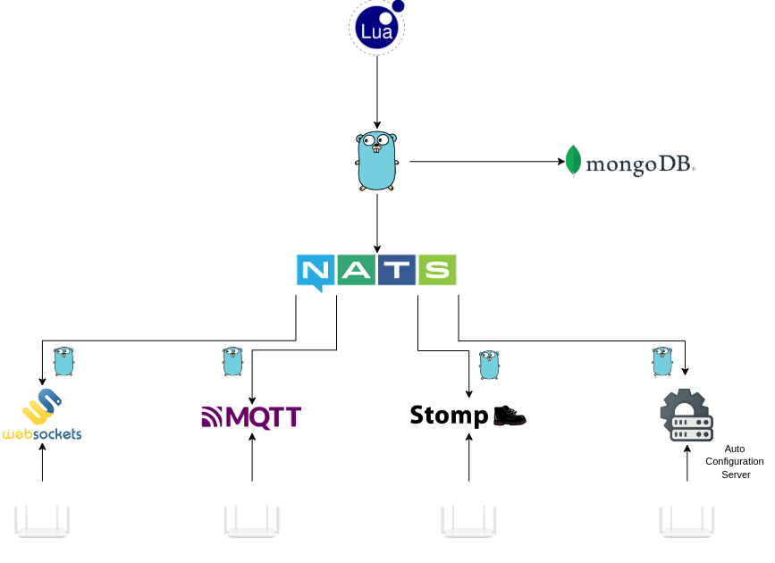

# Scripts

## Introduction

Code is wrritten in **Lua**, which is a lightweight, high-level programming language designed for embedded use, known for its simplicity and efficiency. Created in Brazil in 1993, it features dynamic typing, first-class functions, and a powerful table data structure, making it versatile for various applications. Lua is widely used in game development for scripting game logic, as well as in embedded systems and applications due to its **extensibility and small footprint**, allowing developers to easily integrate it with other languages and platforms.

[LUA 5.1 Manual](https://www.lua.org/manual/5.1/)&#x20;

### How It Works

To extend Oktopus capabilities and adress the most diverse possible use cases we opted to use a scripting language on top of the actual code, so the [gopher-lua](https://github.com/yuin/gopher-lua) library provides Go APIs that allows to easily embed LUA scripts to Go programs.

The Go software can interact to the LUA script and vice-versa. That way, it's possible to pass functions, parameters and events through both USP Controller/ACS and the user created automations.

### Core Concepts

A "custom function", is as a function called from LUA which translates to a Go function that can interact with NATS, MongoDB, USP Controller, TR-069 ACS and all the other components of the software stack.

<figure><figcaption><p>Diagram of Lua Scripts</p></figcaption></figure>

The "custom functions" will be detailed above in the next topics as just "functions" and separated into domain areas. We hope to provide usefull examples, and the limitation is on each person creativity.&#x20;

## Functions

### send\_usp\_message()

#### Params:

1.  Serial Number \[string]

    The CPE unique identifier.
2.  JSON payload \[string]

    Request body to be sent to the CPE.\
    Current supported bodies are : \
    \- Get\
    \- Set

Return:

* If the usp message generates an error:

```json
{
    "error_message": "error to set param test.software",
    "error_code: "500"
}
```

* In the case of a successful transaction each key of the _table_ will correspond to one of the parameters requested in the payload.

Example:



```lua
local uspMsg = [[
{
    "header": {
        "msg_id": "b7dc38ea-aefb-4761-aa55-edaa97adb2f0",
        "msg_type": 1
    },
    "body": {
        "request": {
            "get": {
                "paramPaths": [
                    "Device.STOMP."
                ],
                "maxDepth": 2
            }
        }
    }
}
]]

local serial_number = "oktopus-0-stomp"

local uspMessageResult = send_usp_message(serial_number, uspMsg)
if uspMessageResult["error_message"] ~= nil then
    print("SN: " .. serial_number .. " | Error Message: " .. uspMessageResult["error_message"] .. " | Code: " .. uspMessageResult["error_code"])
else
    for key, value in pairs(uspMessageResult) do
      print(key .. ": " .. value)
    end
end
```





```lua
local uspMsg = [[
{
    "header": {
        "msg_id": "b7dc38ea-aefb-4761-aa55-edaa97adb2f0",
        "msg_type": 4
    },
    "body": {
        "request": {
            "set": {
                "allow_partial":true,
                "update_objs":[
                    {
                        "obj_path":"Device.LocalAgent.",
                        "param_settings":[
                            {
                            "param":"X_VANTIVA-COM_PreConnectTimeout",
                            "value": "55",
                            "required":true
                            }
                        ]
                    }
                ]
            }
        }
    }
}
]]

local serial_number = "oktopus-0-stomp"

local uspMessageResult = send_usp_message(serial_number, uspMsg)
if uspMessageResult["error_message"] ~= nil then
    print("SN: " .. serial_number .. " | Error Message: " .. uspMessageResult["error_message"] .. " | Code: " .. uspMessageResult["error_code"])
else
    for key, value in pairs(uspMessageResult) do
      print(key .. ": " .. value)
    end
end
```





### send\_cwmp\_message()

#### Params:

1.  Serial Number \[string]

    The CPE unique identifier.
2.  XML payload \[string]

    Request body to be sent to the CPE.
3.  Message Type \[integer]

    CWMP message type. \
    0 = getParameterValues\
    1 = setParameterValues\
    2 = addObject\
    3 = deleteObject\
    4 = getParameterNames

Return:

The data returned depends on the TR-069 message type:

* If the CWMP message generates an error:

```json
{
    "error_message": "error to set param test.software",
    "error_code: "500"
}
```

* If it is a read or add operation the function will return a _table_.&#x20;
* If it is a delete or set operation the data returned will be a _boolean_ indicating if the result was a success or failure.

Example:



<pre class="language-lua"><code class="lang-lua">local getParameterValuesType = 0

local xmlContentGet = [[
&#x3C;?xml version="1.0" encoding="UTF-8"?>
&#x3C;soap:Envelope xmlns:soapenc="http://schemas.xmlsoap.org/soap/encoding/" xmlns:xsd="http://www.w3.org/2001/XMLSchema" xmlns:cwmp="urn:dslforum-org:cwmp-1-0" xmlns:soap="http://schemas.xmlsoap.org/soap/envelope/" xmlns:schemaLocation="urn:dslforum-org:cwmp-1-0 ..\schemas\wt121.xsd" xmlns:xsi="http://www.w3.org/2001/XMLSchema-instance">
  &#x3C;soap:Header/>
  &#x3C;soap:Body soap:encodingStyle="http://schemas.xmlsoap.org/soap/encoding/">
    &#x3C;cwmp:GetParameterValues>
      &#x3C;ParameterNames>
        &#x3C;string>InternetGatewayDevice.LANDevice.1.WLANConfiguration.1.&#x3C;/string>
       &#x3C;/ParameterNames>
    &#x3C;/cwmp:GetParameterValues>
  &#x3C;/soap:Body>
&#x3C;/soap:Envelope>
]]
local serial_number = "HUAWNFYC-35454645"

<strong>local getTest = send_cwmp_message(serial_number, xmlContentGet, getParameterValuesType)
</strong>if getTest["error_message"] ~= nil then
   print("SN: " .. serial_number .. " | Error Message: " .. getTest["error_message"] .. " | Code: " .. getTest["error_code"])
else
  for key, value in pairs(getTest) do
    print(key .. ": " .. value)
  end
end
</code></pre>



<pre class="language-lua"><code class="lang-lua">local addObjectType = 2

<strong>local xmlContentAdd = [[
</strong>&#x3C;?xml version="1.0" encoding="UTF-8"?>
&#x3C;soap:Envelope xmlns:soapenc="http://schemas.xmlsoap.org/soap/encoding/" xmlns:xsd="http://www.w3.org/2001/XMLSchema" xmlns:cwmp="urn:dslforum-org:cwmp-1-0" xmlns:soap="http://schemas.xmlsoap.org/soap/envelope/" xmlns:schemaLocation="urn:dslforum-org:cwmp-1-0 ..\schemas\wt121.xsd" xmlns:xsi="http://www.w3.org/2001/XMLSchema-instance">
  &#x3C;soap:Header/>
  &#x3C;soap:Body soap:encodingStyle="http://schemas.xmlsoap.org/soap/encoding/">
    &#x3C;cwmp:AddObject>
      &#x3C;ObjectName>InternetGatewayDevice.LANDevice.1.WLANConfiguration.&#x3C;/ObjectName>
      &#x3C;ParameterKey>&#x3C;/ParameterKey>
    &#x3C;/cwmp:AddObject>
  &#x3C;/soap:Body>
&#x3C;/soap:Envelope>
]]
local serial_number = "HUAWNFYC-OPA123-0"

local addTest = send_cwmp_message(serial_number, xmlContentAdd, addObjectType)
if addTest["error_message"] ~= nil then
    print("SN: " .. serial_number .. " | Error Message: " .. addTest["error_message"] .. " | Code: " .. addTest["error_code"])
 else
    print("instance_number: " .. addTest.instance_number)
    print("status: " .. addTest.status)
end
</code></pre>



```lua
local setParameterValuesType = 1

local xmlContentSet = [[
<?xml version="1.0" encoding="UTF-8"?>
<soap:Envelope xmlns:soapenc="http://schemas.xmlsoap.org/soap/encoding/" xmlns:xsd="http://www.w3.org/2001/XMLSchema" xmlns:cwmp="urn:dslforum-org:cwmp-1-0" xmlns:soap="http://schemas.xmlsoap.org/soap/envelope/" xmlns:schemaLocation="urn:dslforum-org:cwmp-1-0 ..\schemas\wt121.xsd" xmlns:xsi="http://www.w3.org/2001/XMLSchema-instance">
  <soap:Header/>
  <soap:Body soap:encodingStyle="http://schemas.xmlsoap.org/soap/encoding/">
    <cwmp:SetParameterValues>
      <ParameterList>
        <ParameterValueStruct>
          <Name>InternetGatewayDevice.LANDevice.1.WLANConfiguration.1.Enable</Name>
          <Value>1</Value>
        </ParameterValueStruct>
      </ParameterList>
    </cwmp:SetParameterValues>
  </soap:Body>
</soap:Envelope>
]]
local serial_number = "HUAWNFYC-35454645"

local setTest = send_cwmp_message(serial_number, xmlContentSet, setParameterValuesType)
if type(setTest) == "table" then
   print("SN: " .. serial_number .. " | Error Message: " .. setTest["error_message"] .. " | Code: " .. setTest["error_code"])
else
  print("SetParameterValues worked")
end
```



```lua
local deleteObjectType = 3

local xmlContentDelete = [[
<?xml version="1.0" encoding="UTF-8"?>
<soap:Envelope xmlns:soapenc="http://schemas.xmlsoap.org/soap/encoding/" xmlns:xsd="http://www.w3.org/2001/XMLSchema" xmlns:cwmp="urn:dslforum-org:cwmp-1-0" xmlns:soap="http://schemas.xmlsoap.org/soap/envelope/" xmlns:schemaLocation="urn:dslforum-org:cwmp-1-0 ..\schemas\wt121.xsd" xmlns:xsi="http://www.w3.org/2001/XMLSchema-instance">
  <soap:Header/>
  <soap:Body soap:encodingStyle="http://schemas.xmlsoap.org/soap/encoding/">
    <cwmp:DeleteObject>
      <ObjectName>InternetGatewayDevice.LANDevice.1.WLANConfiguration.8.</ObjectName>
      <ParameterKey></ParameterKey>
    </cwmp:DeleteObject>
  </soap:Body>
</soap:Envelope>
]]
local serial_number = "HUAWNFYC-OPA123-0"

local deleteTest = send_cwmp_message(serial_number, xmlContentDelete, deleteObjectType)
if type(deleteTest) == "table" then
    print("SN: " .. serial_number .. " | Error Message: " .. deleteTest["error_message"] .. " | Code: " .. deleteTest["error_code"])
 else
   print("DeleteObject worked")
 end
```



```lua
local getParameterNamesType = 4

local xmlContentGetParameterNames = [[<?xml version="1.0" encoding="UTF-8"?>
<soap:Envelope xmlns:soapenc="http://schemas.xmlsoap.org/soap/encoding/" xmlns:xsd="http://www.w3.org/2001/XMLSchema" xmlns:cwmp="urn:dslforum-org:cwmp-1-0" xmlns:soap="http://schemas.xmlsoap.org/soap/envelope/" xmlns:schemaLocation="urn:dslforum-org:cwmp-1-0 ..schemaswt121.xsd" xmlns:xsi="http://www.w3.org/2001/XMLSchema-instance">
  <soap:Header/>
  <soap:Body soap:encodingStyle="http://schemas.xmlsoap.org/soap/encoding/">
    <cwmp:GetParameterNames>
      <ParameterPath>InternetGatewayDevice.LANDevice.1.WLANConfiguration.</ParameterPath>
      <NextLevel>1</NextLevel>
    </cwmp:GetParameterNames>
  </soap:Body>
</soap:Envelope>
]]
local serial_number = "HUAWNFYC-OPA123-0"

local getParameternames = send_cwmp_message(serial_number, xmlContentGetParameterNames, getParameterNamesType)
if getParameternames["error_message"] ~= nil then
    print("SN: " .. serial_number .. " | Error Message: " .. getParameternames["error_message"] .. " | Code: " .. getParameternames["error_code"])
 else
  for _, value in pairs(getParameternames) do
    print("Parameter Name" .. value)
  end
end
```



### listen\_to\_cwmp\_event()

Listen to TR-069 events as defined in the standard.

#### Params:

1.  Event \[string] (optional)\
    Possible events:

    ```
    "0"- BOOTSTRAP
    "1"- BOOT
    "2"- PERIODIC
    "3"- SCHEDULED
    "4"- VALUE CHANGE
    "5"- KICKED
    "6"- CONNECTION REQUEST
    "7"- TRANSFER COMPLETE
    "8"- DIAGNOSTICS COMPLETE
    "9"- REQUEST DOWNLOAD
    "10"- AUTONOMOUS TRANSFER COMPLETE
    "11"- DU STATE CHANGE COMPLETE
    "12"- AUTONOMOUS DU STATE CHANGE COMPLETE
    ```

    If no value is set, than it listens to all events.
2. Serial Number \[string] (optional)\
   CPE unique identifier. If it's not set then it listens to all CPEs event(s).

Return:

```json
{
    "serial_number": "HUAWNFYC-35454645",
    "event": "0"
}
```

Example:

```lua
while true do
  local cwmp_event = listen_to_cwmp_event("2")
  print("CWMP event " .. cwmp_event.event .. ", triggered by device: " .. cwmp_event.serial_number)
end
```

### get\_device()

Get device attributes from its unique identifier.

#### Params:

1.  Serial Number \[string]

    The CPE unique identifier.

Return:

If the CPE was not found in the database the function returns a boolean with false value. In case the CPE is found it returns a table with all attributes:

```json
{
    "sn": "HUAWNFYC-35454645",
    "model": "WS7001-40",
    "vendor": "Huawei Technologies Co., Ltd.",
    "version": "",
    "product_class": "Huawei",
    "alias": "",
    "status": 2,
    "cwmp": true,
    "usp": false
}
```

Example:

```lua
SERIAL_NUMBER = "HUAWNFYC-35454645"
local deviceAttributes = get_device(SERIAL_NUMBER)
if type(deviceAttributes) == "boolean" then
  print("device " .. SERIAL_NUMBER .. " not found")
else
  for key, value in pairs(deviceAttributes) do
    print(key .. ": " .. tostring(value))
  end
end
```

### listen\_to\_new\_device()

Receive all new device attributes that connect to Oktopus, independent of the protocol.

#### Params:

1. Callback function with new device data

```json
{
    "sn": "HUAWNFYC-35454645",
    "model": "WS7001-40",
    "vendor": "Huawei Technologies Co., Ltd.",
    "version": "",
    "product_class": "Huawei",
    "alias": "",
    "status": 2
}
```

Example:

```lua
function listen_to_new_device_callback(new_device)
  for key, value in pairs(new_device) do
    print(key .. ": " .. tostring(value))
  end
end
listen_to_new_device(listen_to_new_device_callback)
```

### sleep()

Blocks the code execution for certain time.

#### Params:

1. Time duration \[integer]\
   Seconds of blocking the code execution.

Example:

```lua
while true do
  print("I'm going to appear again after 20 seconds")
  sleep(20)
end
```

### create\_or\_update\_device\_credential()

#### Params:

1. Username \[string]
2. Password \[string]

Return:

_Bool_ value indicating _true_ if the operation was successfull or _false_ if there was an error.

Example:

```lua
local username = "test"
local password = "test"

if create_or_update_device_credential(username, password) then
  print("success")
else
  print("error")
end
```

### generate\_random\_string()

#### Params:

1. Length \[int]\
   Size of the string to be generated

Example:

```lua
local username = "deviceX"
local password = generate_random_string(10)

if create_or_update_device_credential(username, password) then
  print("success")
else
  print("error")
end
```

### delete\_device()

Remove device from database.

#### Params:

1.  Serial Number \[string]

    The unique identifier of the CPE to be removed.

Return:

&#x20;_Bool_ value indicating _true_ if the operation was successfull and the device was removed from database or _false_ if there was an error.

Example:

```lua
local sn = "mqtt_client_92"
if delete_device(sn) then
  print("device " .. sn .. " successfully deleted")
else
  print("error to delete device ".. sn)
end
```


\


