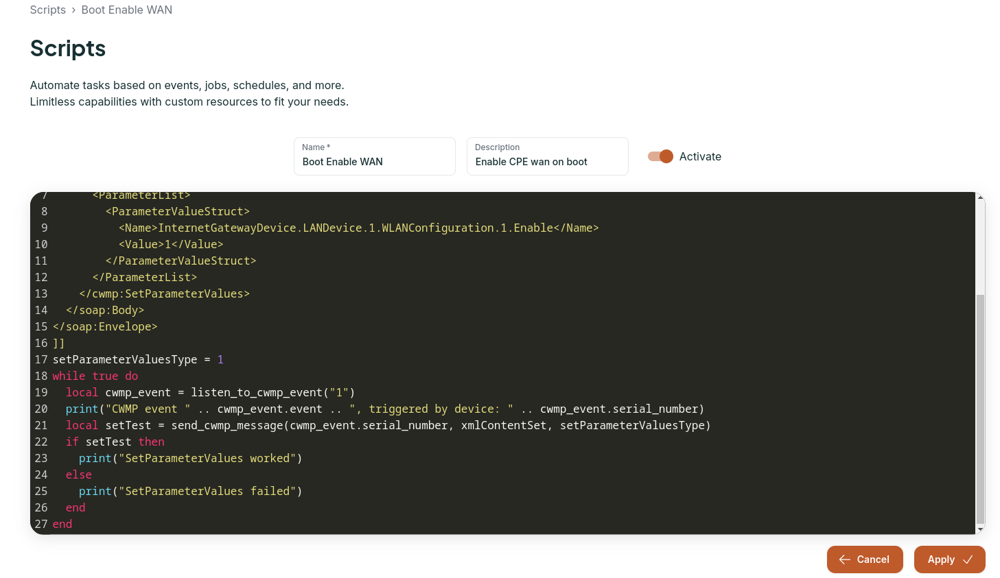

---
layout:
  title:
    visible: true
  description:
    visible: false
  tableOfContents:
    visible: true
  outline:
    visible: true
  pagination:
    visible: true
---

# Installation

Before you dive into the installation methods and documentation about, make sure you've read the [requirements section](../requirements/).

## Quick Start

If you're a developer or someone who just wants to try Oktopus and get a better understanding of CWMP and/or USP standards, don't waste time. Have the software running with one command:

```
wget https://github.com/OktopUSP/oktopus/archive/refs/heads/main.zip && unzip main && cd oktopus-main/deploy/compose && COMPOSE_PROFILES=nats,controller,cwmp,mqtt,stomp,ws,adapter,frontend docker compose up -d
```

The web interface will become accessible at port 80:

<figure><figcaption><p>Oktopus web first acces</p></figcaption></figure>
