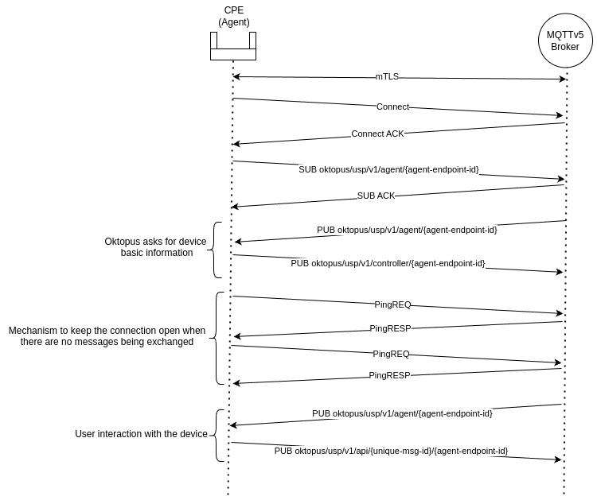

# MQTT

**MQTT (Message Queuing Telemetry Transport)** is a lightweight, publish/subscribe messaging protocol designed for low-bandwidth, high-latency, or unreliable networks. It is widely used in Internet of Things (IoT) applications to enable efficient communication between devices and systems.

At its core, MQTT allows devices to send and receive messages through a central broker. Devices can publish messages on specific topics, and other devices or applications can subscribe to those topics to receive updates in real time. This decoupled architecture makes MQTT highly scalable and ideal for scenarios involving constrained devices or networks, such as smart homes, industrial automation, and remote monitoring systems.

## MQTT version 5

The latest version of the MQTT protocol, introduces significant enhancements over MQTT 3.0 and 3.1.1, addressing limitations and providing greater flexibility, scalability, and usability. The main key points to use MQTTv5 are:

#### Request Response Pattern

Simplifies bidirectional communication by leveraging Response Topics and Correlation Data. It’s a powerful tool for implementing structured, asynchronous interactions

#### Shared Subscriptions

Mltiple clients can subscribe to the same topic and share the message load. This is ideal for implementing scalable, load-balanced systems in environments like cloud services.

#### User Properties

Allows custom key-value pairs to be added to messages and packets through **User Properties**. This enhances metadata handling and enables more advanced workflows, like detailed filtering and richer context sharing.

***

The features mentioned above are important to allow a scalable and automated USP deployment. Since OBUSPA already comes with support to MQTT version 5, that must be your go-to option instead of using MQTTv3.1.1 which demands manual operations on the device side to be done to allow USP communication.

## Oktopus MQTT flow


This diagram applies only to MQTTv5.


<figure><figcaption>
Messages Flow
</figcaption></figure>

## Security

**When MQTT communication occurs over the internet, implementing robust security mechanisms on the broker is essential to protect data and ensure safe operations.**  Without safeguards, attackers could eavesdrop on sensitive data, publish malicious messages, overload the broker with unauthorized requests and even take control over your devices. By enforcing strong authentication, access control, and encryption, you ensure confidentiality, integrity, and availability.

### mTLS **(Mutual Transport Layer Security)**

**\***&#x41;vailable only in the commercial version

Is an extension of the TLS protocol that ensures both parties in a connection—client and server—authenticate each other. The client presents its certificate to the server after verifying the server's certificate, creating a bidirectional trust relationship. This enhances security by verifying both endpoints, making it commonly used in systems where trust between all communicating entities is crucial.

### Username and Password

The credentials are sent as part of the connection request and are validated by the broker against its authentication mechanisms, which can include static user/password stores, databases, or external authentication systems (e.g., OAuth or LDAP). In our case it's validated against NATS key-value store.

Although this method is straightforward and widely used, it has limitations in terms of security. The credentials are transmitted in plain text unless encryption is enabled to protect the communication. To ensure secure authentication, it’s strongly recommended to use **TLS** to encrypt the connection and protect sensitive credentials from being exposed.

[Credentials Configuration](../../getting-started/community-edition.md#credentials) :link:

### Topics ACL (Access Control List)

Restrict and control access to specific topics for MQTT clients. By defining permissions—such as publish, subscribe, or both—on a per-topic basis, ACLs ensure that clients can only interact with topics they are authorized to use. This enhances security by preventing unauthorized access, mitigating risks like data leakage or malicious topic misuse.

Oktopus uses this mechanism to ensure a malicious device or attacker can't forge messages as another device or send messages to control other devices. This way, only the USP Controller has permissions to publish to device topics and communicate with it.

## Broker

Oktopus uses [Mochi](https://github.com/mochi-mqtt/server); which is a fully compliant, embeddable, high-performance MQTT broker designed for modern IoT and messaging applications. It supports MQTT v5 and v3.1.1,  includes robust features like topic-based access control, flexible authentication mechanisms and hooks. Mochi is lightweight yet capable of handling high message throughput and is written in Go, allowing us to fully customize it keeping the same technology stack across all the project components.

### Configuring an Alternative Broker

While Mochi is a strong choice, you can use any MQTT broker that suits your preferences or infrastructure requirements, such as Mosquitto, EMQX, or HiveMQ. The key is to configure the broker to align with [Oktopus's message flow](mqtt.md#oktopus-mqtt-flow)—including topics, authentication, headers, metadata and [user properties](mqtt.md#user-properties).
